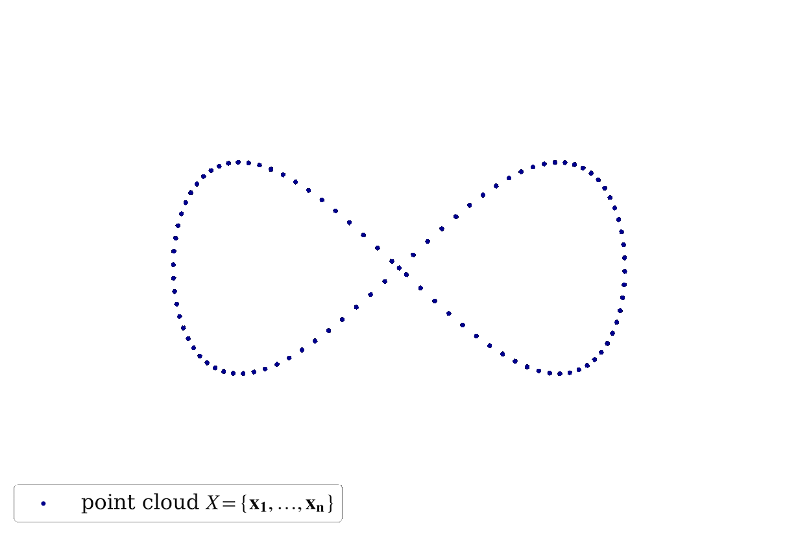

# Efficient Learning on Point Clouds with Basis Point Sets

**Basis Point Set (BPS)** is a simple and efficient method for encoding 3D point clouds into fixed-length 
representations.

It is based on a _**simple idea**_: select k fixed points in space and compute vectors from  these basis points to the nearest
points in the point cloud; use these vectors (or simply their norms) as features:



The basis points are kept fixed for all the point clouds in the dataset, providing a fixed representation of every 
point cloud as a vector. This representation can then be used  as input to arbitrary machine learning methods, in 
particular it can be used as input to off-the-shelf neural networks. 

Below is the example of a simple model using  BPS features as input for the  task of mesh registration over a 
noisy scan:


*FAQ*: what is the key difference between standard occupancy voxels, TSDF and the proposed BPS representation?

_*Answer*_: every BPS cell stores some _continuous global information_ instead
of simple binary flags or local distances. In the latter case, most of the voxels remain empty and, moreover, the feature
vector will change dramatically when slight translations or rotations are applied to an object. In comparison, every BPS
cell always stores some information about the encoded object and the feature vector changes smoothly with respect
to affine transformations. From this also stems the second important observation: when every cell stores some global
information, we can use a _smaller number of cells in order to represent the shape accurately_, thus avoiding
the cubical complexity of the extensive grid representation. BPS also allows arrangements different from a standard 
rectangular grid. Empirically, *simply substituting occupancy voxels with  BPS directional vectors results 
in +9% accuracy improvement of a VoxNet-like Conv3D network on a ModelNet40 classification 
challenge*,  exceeding performance of the PointNet\PointNet++ frameworks while having an order of magnitude 
less floating point operations.

 Check our [ICCV 2019 paper](https://arxiv.org/abs/1908.09186) for more 
 details.

## Usage
 
### Requirements

- Python >= 3.7
- scikit-learn >= 0.21
- PyTorch >= 1.3 (for running provided demos)

### Installation


```
pip3 install git+https://github.com/amzn/basis-point-sets
```

### Code snippet


Converting point clouds to BPS representation takes few lines of code:

```
import numpy as np
from bps import bps

# batch of 100 point clouds to convert
x = np.random.normal(size=[100, 2048, 3])

# optional point cloud normalization to fit a unit sphere
x_norm = bps.normalize(x)

# option 1: encode with 1024 random basis and distances as features
x_bps_random = bps.encode(x_norm, bps_arrangement='random', n_bps_points=1024, bps_cell_type='dists')

# option 2: encode with 32^3 grid basis and full vectors to nearest points as features
x_bps_grid = bps.encode(x_norm, bps_arrangement='grid', n_bps_points=32**3, bps_cell_type='deltas')
# the following tensor can be provided as input to any Conv3D network:
x_bps_grid = x_bps_grid.reshape([-1, 32, 32, 32, 3])
```

### Demos

Clone the repository and install the dependencies:

```
git clone https://github.com/amzn/basis-point-sets
cd basis-point-sets
python setup.py install
pip3 install torch h5py
```


Check one of the provided examples:

- **ModelNet40 3D shape classification with BPS-MLP** (~89% accuracy, ~20 minutes of training on a non-GPU MacBook Pro, 
~2 minutes of training on Nvidia V100 16gb):

```
python bps_demos/train_modelnet_mlp.py
```

- **ModelNet40 3D shape classification with BPS-Conv3D** (~92% accuracy, ~60 minutes of training on Nvidia V100 16gb):

```
python bps_demos/train_modelnet_conv3d.py
```

- **Human body mesh registration**: _coming soon_.


## Citation

If you find our work useful in your research, please consider citing:
```
@inproceedings{prokudin2019efficient,
  title={Efficient Learning on Point Clouds With Basis Point Sets},
  author={Prokudin, Sergey and Lassner, Christoph and Romero, Javier},
  booktitle={Proceedings of the IEEE International Conference on Computer Vision},
  pages={4332--4341},
  year={2019}
}
```
## License

This library is licensed under the MIT-0 License. See the LICENSE file.

